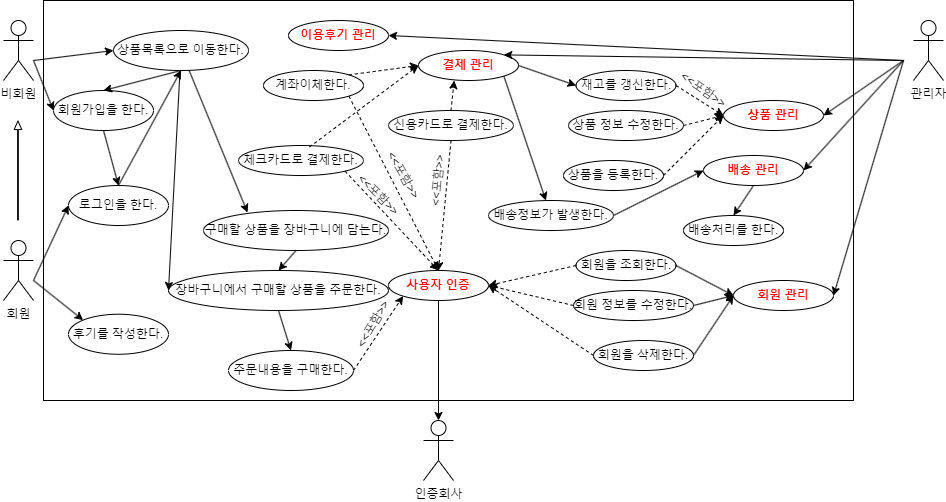

# 프로젝트 개요
https://jeniy01.github.io/web2

## 프로젝트 명 : 건강식품 쇼핑몰

## 프로젝트 기간 : 2023.05.03~05.16

## 프로젝트 참여 : 박지현

## 자바 버전 : jdk 1.8

## 자바스크립트 버전 : 1.0

## 다이나믹 웹 모듈 : 3.1

## 사용 DBMS : Oracle 11g xe + Oracle Sql Developer + ANSI SQL Query

## 자바 사용 라이브러리 : crypto, json, cos, commons, mail

## 통합 개발 도구(IDE) : eclipse Luna

## CSS 프레임워크 : 부트스트랩 3.3.2

## 자바스크립트 플러그인 : JQuery

## 자바스크립트 api : daum 주소 api, json 데이터 처리, iamport 결제 api

## 프로젝트 데이터 처리 패턴 : MVC2(View -> Controller -> Model -> Controller -> View)

## 프로젝트 주요 기능 : 회원, 공지사항, 질문 및 답변, 이용후기, 장바구니, 판매, 배송, 결제 기능 등

## 프로젝트 특이 사항
- 회원 가입시 중복 체크는 json를 활용하여 별도의 팝업 창이 없이 현재 창에서 구현
- 회원 가입시 주소의 입력은 daum 주소 api를 활용하여 주소를 전달하여 구현
- 회원의 비밀번호는 md5, sha256, aes256 등으로 암호화하여 처리하여 구현
- 공지사항은 제목, 내용과 같이 파일 첨부 기능을 함께 구현
- 공지사항 전체 목록의 페이징 처리 기능 구현
- 공지사항 글 검색 기능 구현
- 공지사항 글 상세보기 화면에서 해당 게시된 공지 중에서 파일 다운로드 기능 추가
- 상품 정보는 상품 코드, 카테고리 코드, 상품명, 상품 무게, 단가, 상품 설명, 수량이 등록되도록 구현
- 상품 정보는 기본적인 목록으로 구성하되 메뉴에서 해당 카테고리를 선택하면, 그에 맞는 카테고리의 상품을 목록으로 보여주며, 현재 수량이 0이면 품절로 표시되도록 구현
- 상품 상세보기에서 주문 또는 장바구니 기능이 구현
- 결제시에는 결제 번호, 구매자 아이디, 주문 번호, 결제 수단, 결제 수단 번호, 결제 금액, 결제일 등이 등록되도록 구현
- 결제 기능은 결제 api 기능을 활용하여 다양한 방법으로 결제 테스트가 가능하도록 구현
- 배송 처리는 주문 정보의 내용이 결제 내역에 있는 경우에만 관리자가 배송상태에 따라 배송전, 배송중 또는 배송완료로 처리하도록 구현
- 배송 정보는 배송상태, 택배사, 화물코드, 받는 사람 연락처, 받는 사람 주소로 등록될 수 있도록 구현
- 배송 시스템은 CJ대한통운, 롯데택배, 우체국택배, 로젠택배, 한진택배, CU편의점택배, EMS택배, 경동택배로 나타나도록 구현
- 후기는 댓글과 별점으로 구성되어 구입한 상품에 한에서만 등록할 수 있도록 구현
- 후기 수정은 해당 내용을 작성한 회원만 수정할 수 있도록 구현
- 모든 목록은 페이징 처리가 가능하도록 구현
- 관리자는 회원의 직권 등록, 직권 탈퇴, 정보 수정이 가능하도록 구현
- 관리자는 카테고리의 추가, 수정이 가능하도록 구현
- 관리자는 상품의 목록보기, 등록, 정보 수정, 삭제가 가능하도록 구현
- 관리자는 판매 정보에 대한 목록보기, 반품 처리가 가능하도록 구현
- 관리자는 회원들의 장바구니 정보를 검색, 삭제가 가능하도록 구현
- 관리자는 배송 정보에 대한 등록, 수정, 반품, 배송 철회가 가능하도록 구현
- 관리자는 결제 처리 확인, 철회가 가능하도록 구현

  

------------------------------------------------------------------------------------------------

# 프로젝트 설계

## 개념적 설계
- 유스케이스

## 논리적 설계
- 정보공학적 ERD

- 논리적 검증표(체크리스트)

## 물리적 설계
- 데이터베이스 ERD

## 클래스 설계
- 클래스 다이어그램

## 시퀀스 설계 및 mvc 패턴
- 공지사항 mvc 패턴

- 회원 mvc 패턴

  

------------------------------------------------------------------------------------------------

# 프로젝트 구성

